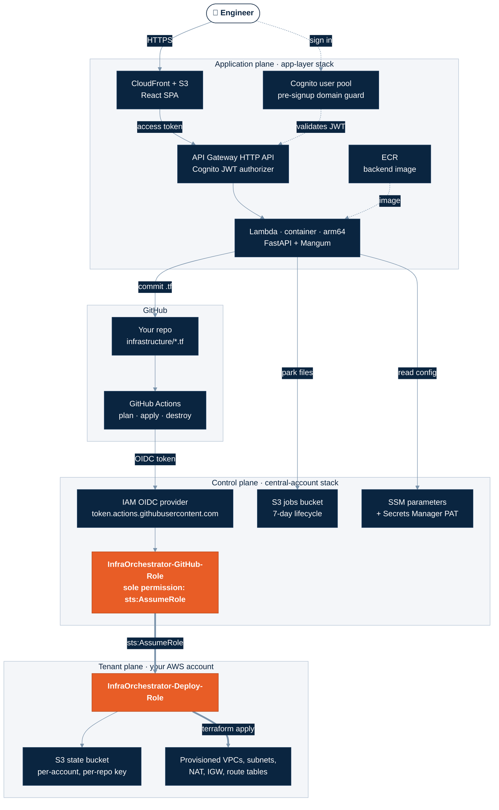
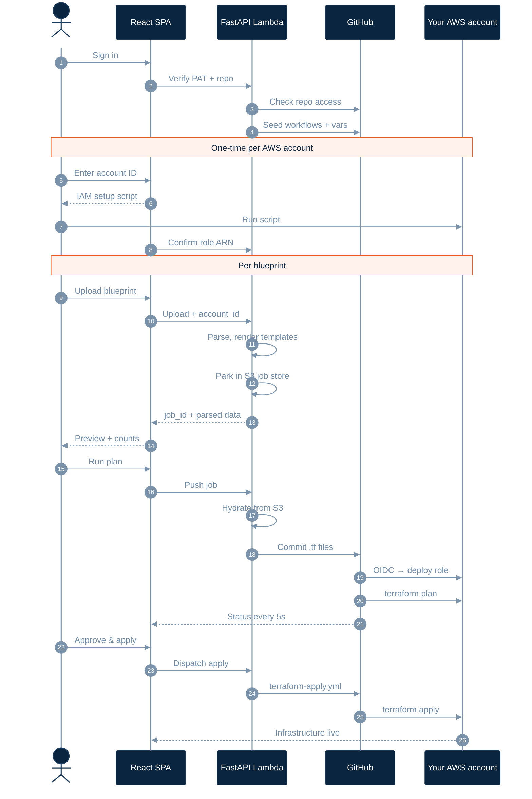
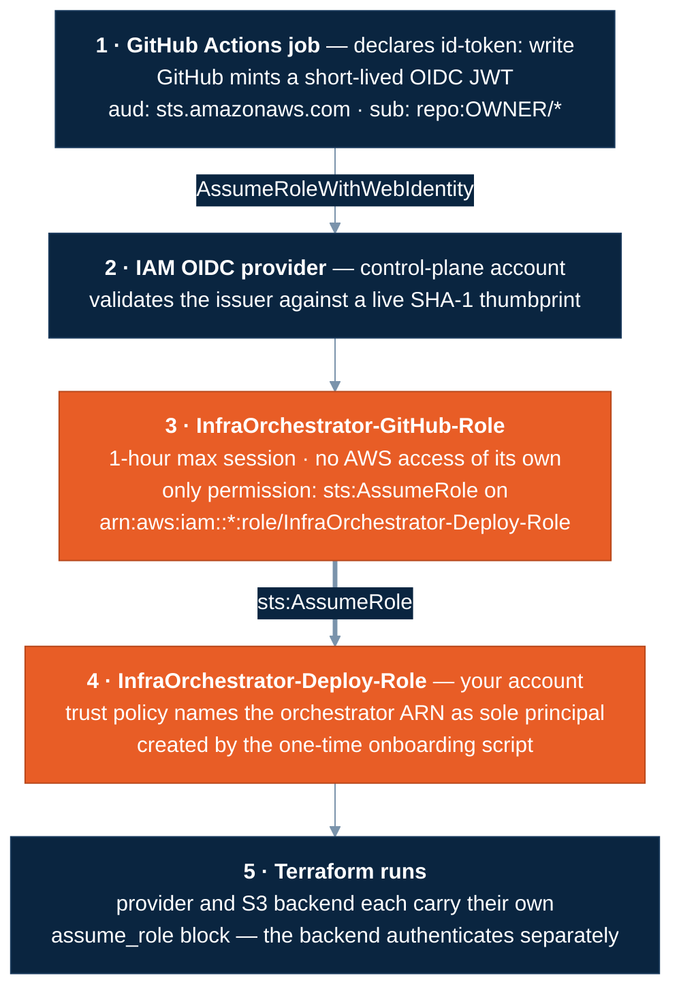
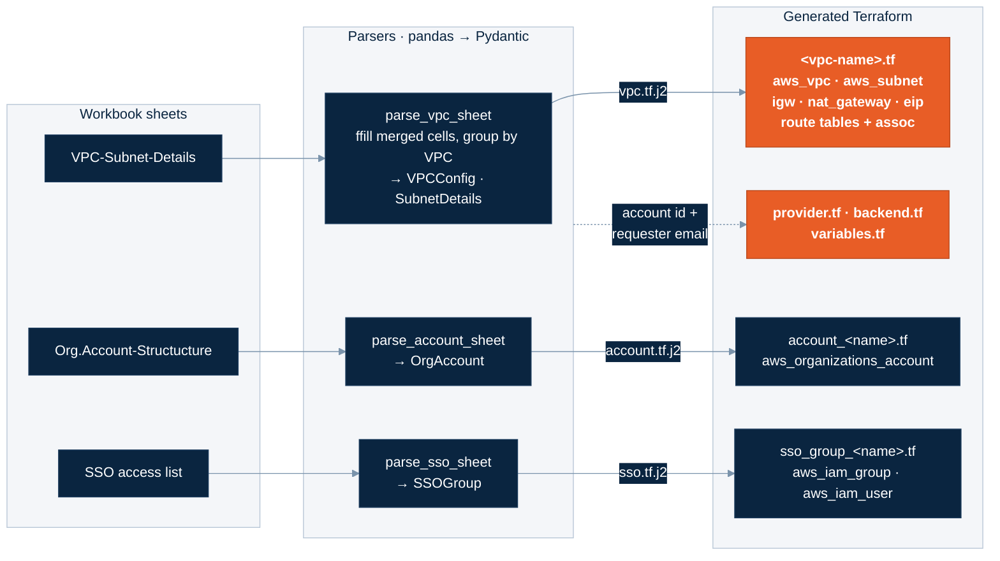
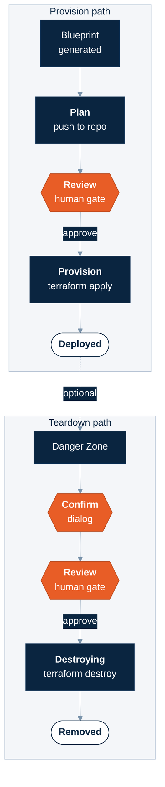

<div align="center">

# ☁️ InfraOrchestrator

### Turn a spreadsheet into deployed AWS infrastructure — with zero long-lived credentials.

Upload an Excel blueprint. Get reviewed, version-controlled Terraform provisioned into **your own AWS account** through a GitOps pipeline that never holds a static access key.

<br/>


</div>

---

## 📑 Contents

| | |
|---|---|
| [**The problem**](#-the-problem) | Why spreadsheet-driven landing zones are slow and risky |
| [**Highlights**](#-highlights) | What this platform actually does |
| [**Architecture**](#%EF%B8%8F-architecture) | The three planes and how they connect |
| [**End-to-end flow**](#-end-to-end-flow) | Every hop from upload to provisioned VPC |
| [**Security model**](#-security-model--zero-standing-credentials) | The credential-free identity chain |
| [**Spreadsheet → Terraform**](#-spreadsheet--terraform) | How a blueprint becomes `.tf` files |
| [**Deployment lifecycle**](#-deployment-lifecycle) | Plan → review → apply → teardown |
| [**Tech stack**](#-tech-stack) | Every moving part |
| [**Repository layout**](#-repository-layout) | Where things live |
| [**Getting started**](#-getting-started) | Full deployment walkthrough |
| [**Configuration**](#%EF%B8%8F-configuration-reference) | Variables and environment |
| [**API reference**](#-api-reference) | Every endpoint |
| [**Hardening checklist**](#%EF%B8%8F-hardening-checklist) | What to change before production |
| [**Known limitations**](#-known-limitations--roadmap) | Honest gaps |

---

## 🎯 The problem

Cloud landing zones almost always start life as a spreadsheet. An architect fills in VPC names, CIDR ranges, subnet tiers, regions, NAT requirements, account structure and SSO groups — and then somebody spends days hand-translating that sheet into Terraform, wiring up a state backend, configuring CI, and minting IAM credentials to let the pipeline deploy.

That handoff is where the time and the risk live:

- **Transcription drift** — the deployed infrastructure quietly diverges from the sheet that was signed off.
- **Credential sprawl** — pipelines get long-lived `AKIA…` keys pasted into CI secrets, and they outlive the project.
- **Shared state** — POCs collapse into one Terraform state file, so one team's `apply` can destroy another's resources.
- **No audit trail** — nobody can tell you who requested a given VPC six months later.

**InfraOrchestrator closes that gap.** The spreadsheet becomes the source of truth, Terraform is generated deterministically from it, and the whole deploy runs on short-lived federated credentials with per-tenant isolated state — while every provisioned resource is tagged back to the person who requested it.

---

## ✨ Highlights

<table>
<tr>
<td width="50%" valign="top">

### 📊 Blueprint-driven generation
Parses a multi-sheet Excel/CSV workbook — VPCs and subnets, organisation accounts, SSO groups — and renders Terraform through Jinja2 templates. NAT gateways, EIPs, route tables and associations are derived from the sheet, not hand-written.

</td>
<td width="50%" valign="top">

### 🔐 Zero standing credentials
No AWS access keys anywhere in the pipeline. GitHub Actions federates via OIDC into a central orchestrator role, which holds exactly one permission: assume a fixed-name deploy role in the target account.

</td>
</tr>
<tr>
<td width="50%" valign="top">

### 🏢 Multi-tenant by convention
Both the deploy-role ARN and the state bucket are *derived* from a 12-digit account ID. Nothing is stored per tenant, so onboarding a new AWS account is a one-time script — no Terraform change, no database row.

</td>
<td width="50%" valign="top">

### 🔄 GitOps with a human gate
Generated Terraform is committed to your repo. `plan` runs automatically on push; `apply` and `destroy` are `workflow_dispatch`-only and fire from an explicit approval click in the UI.

</td>
</tr>
<tr>
<td width="50%" valign="top">

### 📡 Live pipeline telemetry
The UI streams GitHub Actions run, job and step status back into the browser — 5-second polling with a server-side cache and a hard 10-minute cap so it never burns your API rate limit.

</td>
<td width="50%" valign="top">

### 🏷️ Traceable by construction
Every generated provider block stamps `default_tags` with the requester's email, a correlation `JobId` and `ManagedBy`. Every AWS resource points back to who asked for it.

</td>
</tr>
</table>

---

## 🏗️ Architecture

Three separate planes. The **control plane** holds federation and shared config, the **application plane** serves the product, and the **tenant plane** is any AWS account that has run the one-time onboarding script.



> [!NOTE]
> The two orange nodes are the entire trust boundary. The orchestrator role can do **nothing** in AWS except assume a role literally named `InfraOrchestrator-Deploy-Role` — it has no S3, no EC2, no read access of its own.

---

## 🔄 End-to-end flow

What actually happens between dropping a spreadsheet on the page and a VPC existing:



### Why the job store exists

Generation and push are **two separate HTTP requests**, and AWS Lambda may serve them from different containers. Writing to `/tmp` would mean the push request finds an empty directory — or worse, picks up a *different user's* files from a warm container.

So each generation run renders into a unique `mkdtemp()`, is serialised into a single KMS-encrypted S3 object at `jobs/{job_id}.json`, and is rehydrated on push. One atomic `PUT`/`GET`, isolated by UUID, expired automatically after 7 days.

---

## 🔐 Security model — zero standing credentials

This is the part worth reading closely. There is no `AWS_ACCESS_KEY_ID` anywhere in the deployment path.



### The four properties that make this hold

| Property | How it's enforced |
|---|---|
| **No static keys** | Actions exchanges a per-job OIDC JWT for STS credentials via `aws-actions/configure-aws-credentials@v4`. Sessions are capped at 1 hour. |
| **Owner-scoped federation** | The trust policy pins `sub` to `repo:<github_owner>/*`. A Terraform variable validation rejects `*`, `/` and wildcard owners — `repo:*` would trust every repository on GitHub. |
| **Minimal orchestrator** | The central role's *only* statement is `sts:AssumeRole` on `arn:aws:iam::*:role/InfraOrchestrator-Deploy-Role`. Wildcard account, fixed role name — so onboarding needs no Terraform change, and the role is useless on its own. |
| **Tenant-side consent** | Nothing reaches your account until *you* run the setup script that creates the deploy role and names the orchestrator ARN as its trusted principal. The platform never mutates IAM in your account. |

### State isolation

Every tenant gets their own state, derived — never stored:

```
bucket : {account_id}-infraorchestrator-tfstate
key    : {owner}-{repo}/terraform.tfstate
locking: use_lockfile = true    # S3-native, no DynamoDB stale locks
```

> [!IMPORTANT]
> The generated `backend.tf` carries its **own** `assume_role` block, separate from the provider's. The S3 backend authenticates independently of the AWS provider — without it, Terraform would try to read state using the pipeline's base orchestrator credentials, which have no S3 access, and fail with a 403.

### Application-layer auth

- **Cognito user pool** with email as username and code-based verification.
- A **pre-signup Lambda** rejects any address outside the configured domain. This is the real enforcement — the SPA's client-side check is convenience only and can be bypassed by calling Cognito directly.
- Requests carry the Cognito **access token** as a bearer, validated twice: by the API Gateway JWT authorizer *and* by FastAPI middleware against cached JWKS.
- API Gateway declares explicit per-method routes rather than `$default`/`ANY`, so CORS preflight is answered at the edge instead of being rejected by the authorizer.

---

## 📊 Spreadsheet → Terraform



### What the VPC template derives for you

| Sheet input | Generated result |
|---|---|
| `VPC Name` + `CIDR` | `aws_vpc` with DNS support and hostnames enabled |
| Zone-A/B/C name + CIDR columns | one `aws_subnet` per populated zone |
| `NAT Gateway = Yes` | `aws_eip` + `aws_nat_gateway` + a private route table with a `0.0.0.0/0` NAT route |
| `NAT Gateway = No` | public route table only; private subnets emit an inline `# WARNING` and fall back to it |
| always | `aws_internet_gateway`, public route table with `0.0.0.0/0` → IGW, one `aws_route_table_association` per subnet |
| `Region` | the provider region for the generated stack |

Subnet tiering uses the `Route-Table-Association` column plus a `-lb` name heuristic to decide public vs private placement and auto-assign public IP.

> [!TIP]
> A reference workbook shape is expected — sheet names are matched exactly (including the `Org.Account-Structucture` spelling), and subnet zone columns are read **positionally**, so keep the column order intact when you build your own blueprint.

Parsing is **fail-soft**: a malformed row is skipped and appended to an `alerts` array returned with the response, rather than failing the whole upload. The UI surfaces those alerts alongside the blueprint preview.

---

## 🚦 Deployment lifecycle

Both the provision and teardown paths require two deliberate human actions — nothing auto-applies.



Both flows stream live status from `GET /api/v1/github/latest-run`. The poller is filtered by workflow filename so a teardown run can never appear under the provisioning view — an unfiltered "latest run" would let a destroy bleed into the apply panel.

All three generated workflows share a `concurrency` group keyed on the repository with `cancel-in-progress: false`, so two Terraform runs can never overlap on the same state.

---

## 🧰 Tech stack

<table>
<tr><th align="left">Layer</th><th align="left">Choices</th></tr>
<tr>
<td><b>Frontend</b></td>
<td>React 19 · Vite 8 · axios · lucide-react · plain CSS custom properties. No router, no state manager, no component library.</td>
</tr>
<tr>
<td><b>Backend</b></td>
<td>FastAPI + Mangum on Python 3.12 · pandas + openpyxl (parsing) · Pydantic v2 (schemas) · Jinja2 (templating) · GitPython + PyGithub (repo operations) · boto3 · python-jose (JWT).</td>
</tr>
<tr>
<td><b>Compute</b></td>
<td>Container-image Lambda on <b>arm64</b>, 1024 MB / 60 s, fronted by an API Gateway HTTP API with a Cognito JWT authorizer.</td>
</tr>
<tr>
<td><b>Hosting</b></td>
<td>S3 + CloudFront with Origin Access Control; SPA routing via 403/404 → <code>/index.html</code> rewrites.</td>
</tr>
<tr>
<td><b>Identity</b></td>
<td>Cognito user pool (public SPA client, no secret) · pre-signup Lambda domain guard · GitHub OIDC federation into IAM.</td>
</tr>
<tr>
<td><b>IaC</b></td>
<td>Terraform ≥ 1.5 · AWS provider ~> 5.0 · two bootstrap stacks + generated tenant stacks.</td>
</tr>
<tr>
<td><b>CI/CD</b></td>
<td>GitHub Actions — <code>configure-aws-credentials@v4</code> (OIDC) · <code>setup-terraform@v3</code> · retrying <code>init</code> · repo-scoped concurrency.</td>
</tr>
</table>

> [!NOTE]
> The bootstrap stacks require Terraform ≥ 1.5, but *generated* tenant code emits `use_lockfile = true`, which needs **Terraform ≥ 1.10**. The workflows install the latest version, so CI is fine — keep it in mind if you run the generated stack locally.

---

## 📁 Repository layout

```
infra-validator/
│
├── backend/                          FastAPI application (Lambda container)
│   ├── main.py                       App factory, Cognito JWT middleware, Mangum handler
│   ├── api/routers/
│   │   ├── upload.py                 Parse blueprint → render Terraform → park job
│   │   ├── git_ops.py                Push, bootstrap workflows, cross-account setup, destroy
│   │   ├── github_api.py             Validate PAT, dispatch apply
│   │   ├── github_status.py          Cached Actions run/job/step telemetry
│   │   └── state_ops.py              Raw state read/write  (legacy — see limitations)
│   ├── core/
│   │   ├── config.py                 SSM/Secrets lookups, ARN + bucket derivation
│   │   └── excel_parser.py           Sheet → model parsers
│   ├── models/                       Pydantic schemas (VPC, subnet, account, SSO, git creds)
│   ├── templates/                    Jinja2 → .tf  (vpc, account, sso)
│   ├── utils/
│   │   ├── generator.py              Per-request render, provider.tf + backend.tf emission
│   │   ├── git_ops.py                Clone, replace infrastructure/, commit, push
│   │   ├── github_api.py             REST calls, Actions variable upsert
│   │   └── job_store.py              S3-backed handoff between generate and push
│   └── Dockerfile                    arm64 Python 3.12 Lambda image
│
├── frontend/                         React SPA
│   └── src/
│       ├── App.jsx                   Auth, provisioning, cross-account setup, state, docs
│       ├── PipelineStatus.jsx        Live Actions run/job/step viewer
│       └── ui.jsx                    StatCard, Pill primitives
│
├── foundation/
│   ├── central-account/              Control plane: OIDC, orchestrator role, state
│   │                                 backend, jobs bucket, SSM + Secrets Manager
│   ├── app-layer/                    Cognito, pre-signup Lambda, ECR, backend Lambda,
│   │   ├── presignup/index.py        API Gateway, S3 + CloudFront frontend
│   │   └── build-and-push.sh         arm64 buildx → ECR (attestations disabled)
│   └── user-setup/                   Tenant onboarding  (see limitations)
│
└── Runbook.md                        Step-by-step deployment commands
```

---

## 🚀 Getting started

### Prerequisites

```bash
aws sts get-caller-identity   # pointed at the account that will host the platform
terraform version             # >= 1.5
docker info                   # daemon running — the backend image is arm64
node --version                # for the frontend build
```

You will also need a **fine-grained GitHub PAT** on the repository the generator pushes to, with **Contents: read/write** and **Workflows: read/write**.

Decide up front:

- `github_owner` — your GitHub username or org. **Never `*`.**
- `github_target_repo` — `<owner>/<repo>` beneath that owner.
- Three globally-unique S3 bucket names: state, jobs, frontend.

### 1 · Control plane

```bash
cd foundation/central-account
cp terraform.tfvars.example terraform.tfvars   # then edit
terraform init && terraform apply
terraform output          # orchestrator_role_arn · jobs_bucket · github_pat_secret_name
```

Store the PAT out-of-band so it never lands in state or tfvars:

```bash
aws secretsmanager put-secret-value \
  --secret-id infraorchestrator/github-pat \
  --secret-string 'YOUR_FINE_GRAINED_PAT' \
  --region ap-south-1
```

> [!NOTE]
> This stack begins on **local state** — its own S3 backend is commented out, because the bucket it would use doesn't exist until the first apply. Once applied, uncomment `backend.tf`, fill in the bucket name, and run `terraform init -migrate-state`.

### 2 · Application plane

The Lambda can't be created before an image exists, so ECR comes first:

```bash
cd ../app-layer
cp terraform.tfvars.example terraform.tfvars   # then edit
terraform init

terraform apply -target=aws_ecr_repository.backend      # (a) repo only

cd ../../backend                                        # (b) build + push arm64
../foundation/app-layer/build-and-push.sh \
  "$(cd ../foundation/app-layer && terraform output -raw ecr_repo_url)" latest

cd ../foundation/app-layer                              # (c) everything else
terraform apply
terraform output   # cognito_pool_id · cognito_app_client_id · backend_api_url
                   # cloudfront_domain · frontend_bucket
```

### 3 · Frontend

```bash
cd ../../frontend
cp .env.example .env    # fill from the outputs above
npm install && npm run build
aws s3 sync dist/ "s3://<frontend_bucket>/" --delete

DIST_ID=$(aws cloudfront list-distributions \
  --query "DistributionList.Items[?DomainName=='<cloudfront_domain>'].Id" --output text)
aws cloudfront create-invalidation --distribution-id "$DIST_ID" --paths "/*"
```

Open `https://<cloudfront_domain>`.

### 4 · Onboard a tenant account

In the UI: **Verify connection** → **Cross-account AWS setup** → paste the 12-digit account ID → copy the generated script → run it with AWS CLI credentials **for that target account** → **Confirm setup**.

> [!WARNING]
> The generated script creates the IAM deploy role but **not** the Terraform state bucket. Create it yourself before the first plan, or `terraform init` will fail:
> ```bash
> aws s3 mb "s3://<account_id>-infraorchestrator-tfstate" --region ap-south-1
> aws s3api put-bucket-versioning --bucket "<account_id>-infraorchestrator-tfstate" \
>   --versioning-configuration Status=Enabled
> ```

### 5 · Smoke test

1. Sign up with an allowed email domain → confirm the 6-digit code. Try a disallowed domain first; the pre-signup Lambda should reject it.
2. **Verify connection** — repo URL + PAT. Workflows and Actions variables are seeded automatically.
3. **Cross-account setup** as above.
4. **Upload** a blueprint → **Generate** → **Run plan** → watch it in the repo's Actions tab → **Approve & apply**.

---

## ⚙️ Configuration reference

### Frontend — `frontend/.env`

| Variable | Purpose |
|---|---|
| `VITE_API_URL` | API Gateway endpoint (`backend_api_url` output) |
| `VITE_COGNITO_REGION` | Region hosting the user pool |
| `VITE_COGNITO_CLIENT_ID` | SPA app client id |
| `VITE_COGNITO_POOL_ID` | Reserved for future use |
| `VITE_ORCHESTRATOR_ROLE_ARN` | Trusted principal baked into the generated tenant script |
| `VITE_DEPLOY_ROLE_NAME` | Optional — defaults to `InfraOrchestrator-Deploy-Role` |
| `VITE_DEPLOY_BRANCH` | Optional — defaults to `main` |

### Backend — Lambda environment

| Variable | Notes |
|---|---|
| `COGNITO_POOL_ID` | **Required** — fails fast at import if unset |
| `COGNITO_APP_CLIENT_ID` · `COGNITO_REGION` | Token validation |
| `JOBS_BUCKET` | Generate → push handoff bucket |
| `DEPLOY_ROLE_NAME` · `STATE_BUCKET_SUFFIX` | Naming conventions used for ARN/bucket derivation |
| `SSM_TARGET_REPO` · `SSM_ORCHESTRATOR_ROLE` · `SECRET_GITHUB_PAT` | Parameter and secret names |

Runtime config is read from **SSM Parameter Store** and **Secrets Manager**, not baked into the image. The target-repo parameter is deliberately *uncached*, so changing it in the console takes effect without a redeploy.

### Terraform variables — highlights

| Variable | Default | Notes |
|---|---|---|
| `github_owner` | — | Validated against `*` and `/`. Defines the federation blast radius. |
| `github_target_repo` | — | Must match `owner/repo`. |
| `use_environment_gate` | `false` | See [limitations](#-known-limitations--roadmap) before enabling. |
| `deploy_role_name` | `InfraOrchestrator-Deploy-Role` | Must match the backend's derivation constant. |
| `image_tag` | `latest` | Mutable tag — pin a digest for production. |

---

## 📡 API reference

All routes require `Authorization: Bearer <cognito-access-token>`.

### Provisioning

| Method | Path | Purpose |
|---|---|---|
| `POST` | `/api/v1/upload/infrastructure-data` | Multipart upload. Parses the blueprint, renders Terraform, parks it, returns `job_id` + parsed data + alerts. |
| `POST` | `/api/v1/git/push` | Hydrates a job from S3 and commits it into the repo's `infrastructure/` folder. |

### Repository & credentials

| Method | Path | Purpose |
|---|---|---|
| `POST` | `/api/v1/github/validate` | Verifies PAT and repository access. |
| `POST` | `/api/v1/git/bootstrap` | Seeds the three GitOps workflows and sets `AWS_ROLE_ARN` / `AWS_REGION` Actions variables. |
| `POST` | `/api/v1/git/setup-cross-account` | Validates the account ID and derived role ARN, then sets repo variables. Mutates no IAM. |

### Pipeline control

| Method | Path | Purpose |
|---|---|---|
| `POST` | `/api/v1/github/apply` | `workflow_dispatch` on `terraform-apply.yml`. |
| `POST` | `/api/v1/git/destroy-trigger` | `workflow_dispatch` on `terraform-destroy.yml`. |
| `POST` | `/api/v1/destroy` | Archives `infrastructure/*` into a timestamped folder and commits. |

### Telemetry

| Method | Path | Purpose |
|---|---|---|
| `GET` | `/api/v1/github/latest-run?workflow=` | Latest run plus its jobs and steps. Comma-separated workflow filter. |
| `GET` | `/api/v1/github/runs?limit=` | Recent run summaries (1–20). |
| `GET` | `/api/v1/github/runs/{run_id}/jobs` | Jobs and steps for one run. |
| `GET` | `/` | Unauthenticated health check. |

Status responses are cached per container for 3 seconds so many concurrent pollers watching one deploy don't multiply into GitHub API calls.

---

## 🛡️ Hardening checklist

This platform was built and demonstrated as a POC. Everything below is a deliberate, documented shortcut — work through it before production use.

- [ ] **Scope down the tenant deploy role.** The generated script attaches `PowerUserAccess`. Replace it with a policy covering only the resource types you provision. *This is the single largest posture item.*
- [ ] **Enable the environment gate.** Set `use_environment_gate = true` and pin OIDC `sub` to a named GitHub Environment with required reviewers — but see the limitation note first.
- [ ] **Narrow CORS.** `allow_origins = ["*"]` on the HTTP API should become the CloudFront domain.
- [ ] **Pin the container image** by digest instead of the mutable `latest` tag; add an ECR lifecycle policy.
- [ ] **Add an ExternalId condition** to the tenant deploy role's trust policy.
- [ ] **Strengthen Cognito** — enable MFA, require lowercase and symbols, and move off the default Cognito email sender.
- [ ] **Add observability** — API Gateway access logs and throttling, CloudFront logging, and a WAF.
- [ ] **Rotate the PAT** on a schedule; consider a GitHub App instead of a personal token.
- [ ] **Migrate the control-plane stack to remote state** and stop tracking local `.tfstate`.

---

## 🧭 Known limitations & roadmap

Stated plainly, so nothing here surprises you.

| Area | Current state |
|---|---|
| **Blueprint validation** | Only CIDR *syntax* (via `ipaddress`) and email format are checked. There is **no** CIDR-overlap detection, no subnet-within-VPC containment check, and no region or naming validation. `core/validator.py` is an empty placeholder — this is the most valuable next contribution. |
| **Tenant state bucket** | The generated onboarding script creates the IAM role only. The state bucket must be created manually (see [step 4](#4--onboard-a-tenant-account)). Folding it into the script is a small, high-value fix. |
| **`use_environment_gate`** | Enabling it changes the OIDC `sub` to require `:environment:<name>`, but the generated workflows declare no `environment:` key — so enabling it today will break authentication. Both sides need to change together. |
| **State editor** | The **State** screen targets hardcoded legacy bucket constants that predate per-tenant state, and the Lambda's execution role grants S3 only on the jobs bucket. Expect `AccessDenied` in a deployed environment. Reading tenant state cross-account requires the deploy role to also trust the Lambda's role — out of scope so far. |
| **Subnet tiering** | The `Route-Table-Association` column sits below the header row in the reference workbook, so it currently falls back to `Private` for every subnet; the `-lb` name heuristic is what rescues load-balancer tiers. Worth fixing in the parser. |
| **`foundation/user-setup/`** | The checked-in `setup-deploy-role.sh` is an empty placeholder. The script users actually run is generated client-side by the UI. |
| **SSO templates** | `sso.tf.j2` renders plain IAM groups and users, not IAM Identity Center assignments, despite the naming. |
| **Session handling** | Token expiry is only checked on page load, and there is no refresh-token flow — a long-lived tab will start receiving 401s until reloaded. |
| **Tests** | There is no test suite. Adding coverage around the parsers and generator would be the highest-leverage first PR. |

Documentation note: `Runbook.md` and `foundation/app-layer/README.md` predate the migration from a Lambda Function URL to API Gateway, and still reference a `backend_function_url` output. The correct output is **`backend_api_url`**. This README reflects the current code.

---

## 🤝 Contributing

Issues and pull requests are welcome — the [limitations table](#-known-limitations--roadmap) is a ready-made roadmap, and the validation engine is the most impactful place to start.

```bash
# Backend
cd backend && pip install -r requirements.txt && uvicorn main:app --reload

# Frontend
cd frontend && npm install && npm run dev
```

Please keep real account IDs, Cognito identifiers, PATs and `.tfstate` files out of commits — `.gitignore` covers the known paths, but check `git status` before you push.

---

## 📄 License

No license file is present yet. Add one before accepting external contributions or publishing this as a reusable template.

---

<div align="center">

**Built by the Engineering team at Minfy Technologies**

*Spreadsheet in. Reviewed, credential-free, tagged infrastructure out.*

</div>
